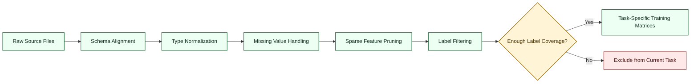
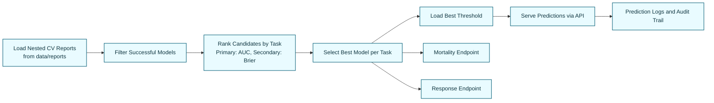

# Chapter 3 Mermaid Figures (Ready to Export)

Use each Mermaid block in mermaid.live or any Mermaid-supported editor, then export as PNG.

Export settings recommended:

- Width: 2200 to 2600 px
- Background: white
- Format: PNG
- File names: keep the names shown under each figure

---

## Figure 3.1 End-to-End System Architecture for Dual-Task Prediction

Save as: data/reports/fig_3_1_architecture.png

```mermaid
flowchart LR
	A[Data Sources<br/>SEER, cBioPortal, GDC] --> B[Harmonization Layer]
	B --> C[Feature Engineering]
	C --> D{Dual-Task Split}
	D --> D1[Mortality Task]
	D --> D2[Response Task]
	D1 --> E[Model Training<br/>LightGBM, XGBoost, TabNet]
	D2 --> E
	E --> F[Evaluation and Explainability<br/>ROC, Calibration, Brier, SHAP]
	F --> G[Report Store<br/>JSON + PNG Artifacts]
	G --> H[Deployment API<br/>Flask Service]
	G --> I[Best-Model Auto-Selection<br/>Per Task]
	I --> H

	classDef stage fill:#e8f1ff,stroke:#315a9f,stroke-width:1.5px,color:#0f2244;
	classDef decision fill:#fff4d6,stroke:#9a6b00,stroke-width:1.5px,color:#4a3300;
	class A,B,C,D1,D2,E,F,G,H,I stage;
	class D decision;
```



Placement in report:

- Insert at end of Section 3.1
- Caption: Figure 3.1 End-to-End System Architecture for Dual-Task Prediction

---

## Figure 3.2 Data Harmonization and Preprocessing Workflow

Save as: data/reports/fig_3_2_preprocessing_workflow.png



Placement in report:

- Insert at end of Section 3.3
- Caption: Figure 3.2 Data Harmonization and Preprocessing Workflow

---

## Figure 3.3 Model Training and Nested Cross-Validation Pipeline

Save as: data/reports/fig_3_3_nested_cv_pipeline.png

```mermaid
flowchart LR
	A[Input Feature Matrix] --> B[Outer Fold Split<br/>Fold 1, 2, 3]
	B --> C[Inner CV Tuning<br/>per Outer Fold]
	C --> D[Best Hyperparameters]
	D --> E[Outer Fold Validation Metrics]
	E --> F[Aggregate Mean and Std]
	F --> G[AUC Confidence Interval]
	F --> H[Threshold Optimization]
	G --> I[Final Model Ranking]
	H --> I

	J[CI95 = mean AUC +/- 1.96 x (std / sqrt(K))<br/>K = number of outer folds]:::formula

	classDef step fill:#f0efff,stroke:#5548a6,stroke-width:1.5px,color:#1e1a44;
	classDef formula fill:#fff8e6,stroke:#a27800,stroke-width:1.5px,color:#4a3600;
	class A,B,C,D,E,F,G,H,I step;
```

Placement in report:

- Insert at end of Section 3.5
- Caption: Figure 3.3 Model Training and Nested Cross-Validation Pipeline

---

## Figure 3.4 Deployment and Auto-Selection Workflow

Save as: data/reports/fig_3_4_deployment_workflow.png



Placement in report:

- Insert at end of Section 3.8
- Caption: Figure 3.4 Deployment and Auto-Selection Workflow

---

## Quick Export Workflow

1. Open https://mermaid.live
2. Paste one Mermaid block.
3. Click Actions -> Download PNG.
4. Save with the exact file name shown for that figure.
5. Repeat for all four figures.
6. Insert the PNGs into Word at the specified section ends.

---

## Word-Fit + High-Quality Settings (Use Exactly)

If your images look blurry or overflow in Word, use these exact settings.

### 1) Export Size (important)

For each Mermaid figure, export PNG at:

- Width: 2400 px
- Height: auto (keep aspect ratio)
- Background: white

Why this works:

- Word report target width is 15.5 to 16.0 cm.
- At print quality (300 DPI), 16 cm needs about 1890 px.
- Exporting at 2400 px gives extra clarity without oversized files.

### 2) Insert Correctly in Word

Do not copy-paste screenshots.
Use:

- Insert -> Pictures -> This Device
- Select the PNG from data/reports

### 3) Set Exact Figure Size in Word

After inserting each image:

1. Click image -> Picture Format -> Size launcher (small arrow).
2. Check "Lock aspect ratio".
3. Set Width to 15.8 cm.
4. Keep Height auto.
5. Alignment: Center.

This ensures every figure fits inside margins.

### 4) Stop Word from Reducing Quality

In Word:

1. File -> Options -> Advanced
2. Scroll to "Image Size and Quality"
3. Check "Do not compress images in file"
4. Set "Default resolution" to "High fidelity"

If this is not enabled, Word can blur your images.

### 5) Caption Spacing for Clean Layout

For each figure:

- Put caption below image
- Font: Times New Roman, 11
- Spacing before caption: 6 pt
- Spacing after caption: 6 pt

### 6) Recommended Placement Width by Figure Type

- Figure 3.1: Width 16.0 cm
- Figure 3.2: Width 15.8 cm
- Figure 3.3: Width 16.0 cm
- Figure 3.4: Width 15.8 cm

### 7) Quick Quality Check Before Final PDF

Zoom Word to 200%:

- Text inside boxes should still be readable.
- Arrow labels should be sharp.
- No pixelation on straight lines.

If blurry, re-export at 2800 px width and reinsert.
